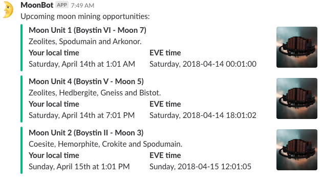

# EVE MoonBot

This Ruby application can be used to notify Slack channels of the upcoming
availability of moon mining belts created by a corporation's refineries.

## Configuration

### SSO and ESI Configuration

The application takes its configuration from `config.yaml`. This contains
various secrets, so I haven't included the one I'm using in the repository.
Instead, `example-config.yaml` can be used as a template.

You need to have registered a third-party application with CCP
at <https://developers.eveonline.com>; this will give
you the `client_id` and `client_secret` values to put in the configuration.
Your application's registration should include at least the following scopes:

* esi-corporations.read_structures.v1
* esi-industry.read_corporation_mining.v1

Once you have a registered application, you need to manually use the EVE SSO
to log in as a character from the target corporation with the "Station Manager"
role, and request those same scopes. If you don't know how to do this, CCP
have [a step-by-step article](https://developers.eveonline.com/blog/article/sso-to-authenticated-calls)
covering the process.

The resulting refresh token goes into the
`refresh_token` configuration item.

### Mining Configuration

The `systems` configuration item is a list of solar system names; the
application will filter out any extractions happening in other systems.

The `minerals` item gives you somewhere to put a list of the minerals resulting
from the operation. It's impossible to get this information from the API
(that is what survey probes are for), so you have to get this information
in-game somehow.

### Slack Configuration

If there are some extractions to notify (within the given solar systems and
within the next six days) then Slack's "incoming webhooks" facility is used
to make a nice notification with an attachment per moon. The details are
nested under a `slack` configuration item:

* The URL you get from your webhook configuration goes in `webhook_url`

* `channel` can be a public or private channel prefixed by `#`, e.g.,
  `'#moonstuff'`. It can also be a user name prefixed by `@`.

## Setup and Execution

Set up as follows:

```bash
$ bundle install --path vendor
```

Execute like this:

```bash
$ bundle exec ruby moonbot.rb
```

Over in Slack, you might see something like this:


